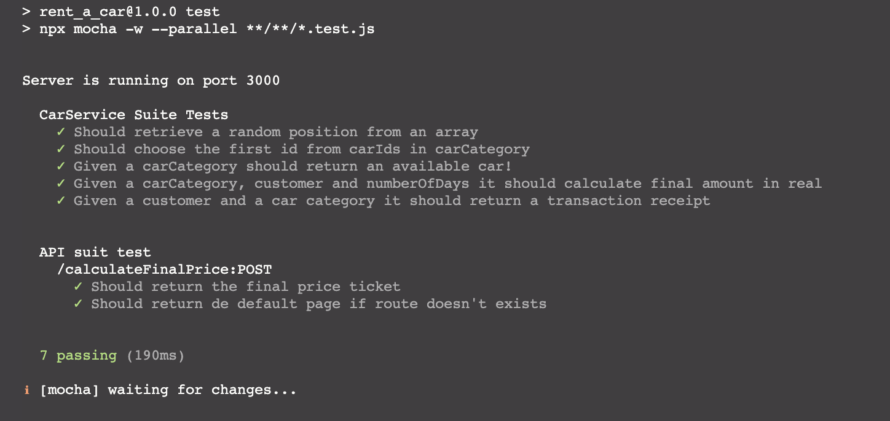
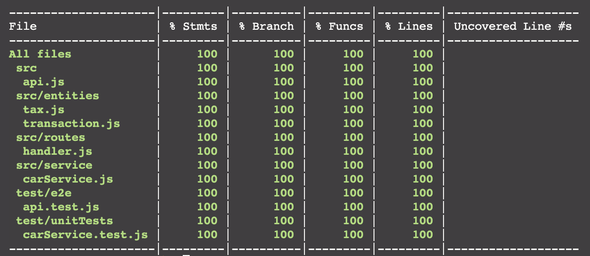
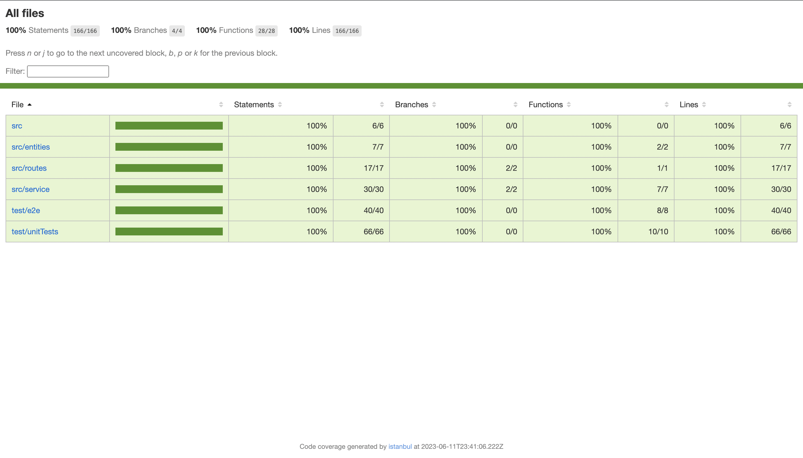

# **Rent a Car API**

## **Summary**
- [**Overview**](#overview);
- [**Quick Start**](#quick-start);
- [**Dependencies**](#dependencies);
- [**Tests**](#tests);

___

## **Overview**

In this repo I've build simple example of a car rental company API, using ***BDD - Behavior Driven Development*** methodology based on the content of the [***Erick Wendel - Javascript Expert Course***](https://cursos.erickwendel.com.br/).

The goal was to built the API with the units and e2e tests, using ***mocks***, ***stubs*** and ***spys*** to ensure that our test will always work independent of external data or API's, and improve the testing time too.

[**Return to Top**](#rent-a-car-api)

___

## **Quick Start**

1 - Clone the repository locally and install the dependencies with:

```bash
npm install
```

2 - Run the API using the command:

```bash
npm run start
```

3 - Make a request to the API in your terminal using curl:

```bash
curl -X POST --data '{ 
"customer": {
    "id": "b3bbb92b-eb0d-41fb-a76d-9a05bcb0cbc9",
    "name": "Earl Jones",
    "age": 28
}, 
"carCategory": {
    "id": "c6113318-ff79-448e-bdfe-fe1e7d175831",
    "name": "Wagon",
    "carIds": [
        "f83721ce-8002-4cc8-afac-b6c4965acd6a",
        "aeaa7eee-8848-4695-b915-cf2ff856aa02",
        "16a4505a-2a3e-4975-b83c-61e17e81cf0e"
    ],
    "price": 49.31
},
"numberOfDays": 10
}' localhost:3000/calculateFinalPrice
```

4 - Expect result:

```bash
{
    "customer":{
    "id":"b3bbb92b-eb0d-41fb-a76d-9a05bcb0cbc9",
    "name":"Earl Jones",
    "age":28
    },
    "car":{
    "id":"aeaa7eee-8848-4695-b915-cf2ff856aa02",
    "name":"Beetle",
    "releaseYear":2023,
    "available":true,
    "gasAvaliable":true
    },
    "amount":"R$ 739,65",
    "dueDate":"21 de junho de 2023"
}
```

[**Return to Top**](#rent-a-car-api)

___

## **Dependencies**

* [**Chai**](https://www.npmjs.com/package/chai)
* [**Faker**](https://www.npmjs.com/package/faker)
* [**Mocha**](https://www.npmjs.com/package/mocha)
* [**nyc**](https://www.npmjs.com/package/nyc) 
* [**Sinon**](https://www.npmjs.com/package/sinon)
* [**Supertest**](https://www.npmjs.com/package/supertest)

[**Return to Top**](#rent-a-car-api)

___

## **Tests**

1 - Run the tests locally:

```bash
npm run test
```



2 - Run the test coverage:

```bash
npm run test:cov
````



3 - Open on the browser using **./coverage/index.html**:



[**Return to Top**](#rent-a-car-api)